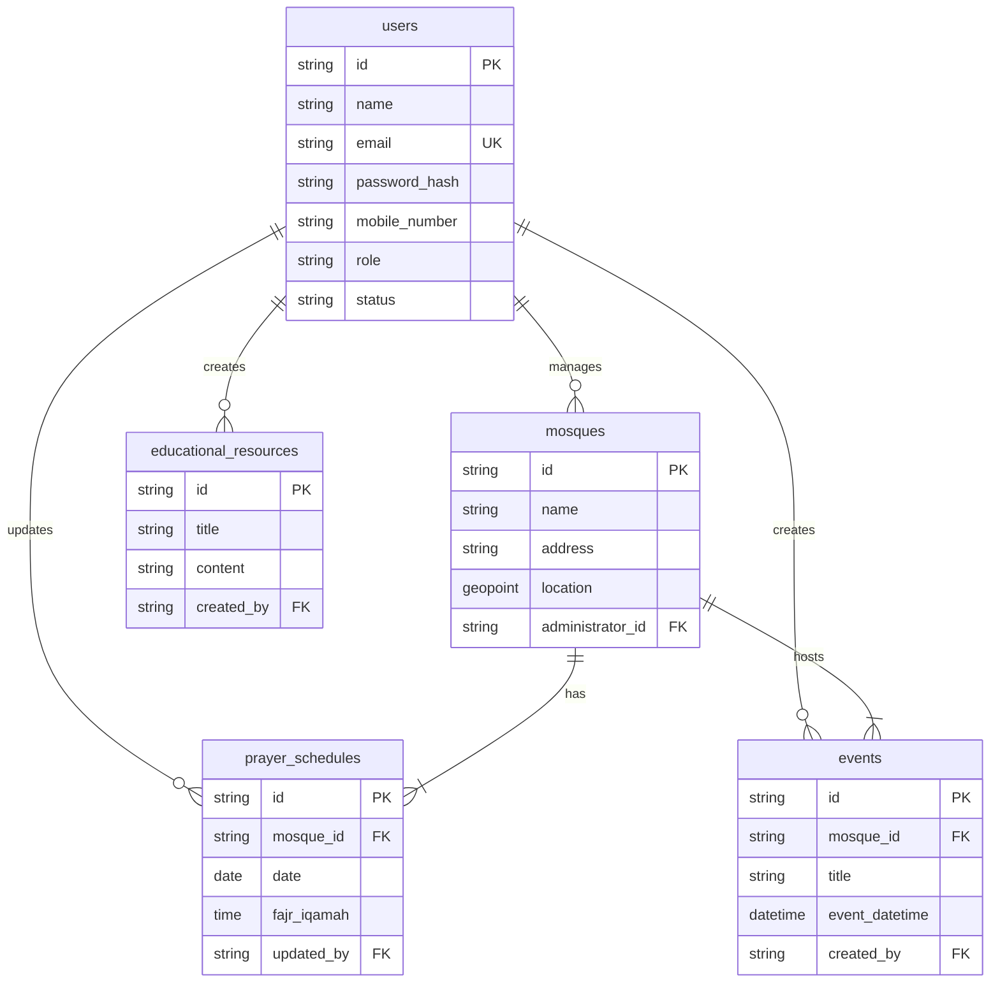

```mermaid
erDiagram
    users {
        string id PK
        string name
        string email UK
        string password_hash
        string mobile_number
        string role
        string status
    }

    mosques {
        string id PK
        string name
        string address
        geopoint location
        string administrator_id FK
    }

    prayer_schedules {
        string id PK
        string mosque_id FK
        date date
        time fajr_iqamah
        string updated_by FK
    }

    events {
        string id PK
        string mosque_id FK
        string title
        datetime event_datetime
        string created_by FK
    }

    educational_resources {
        string id PK
        string title
        string content
        string created_by FK
    }

    users ||--o{ mosques : "manages"
    users ||--o{ prayer_schedules : "updates"
    users ||--o{ events : "creates"
    users ||--o{ educational_resources : "creates"
    mosques ||--|{ prayer_schedules : "has"
    mosques ||--|{ events : "hosts"
```
